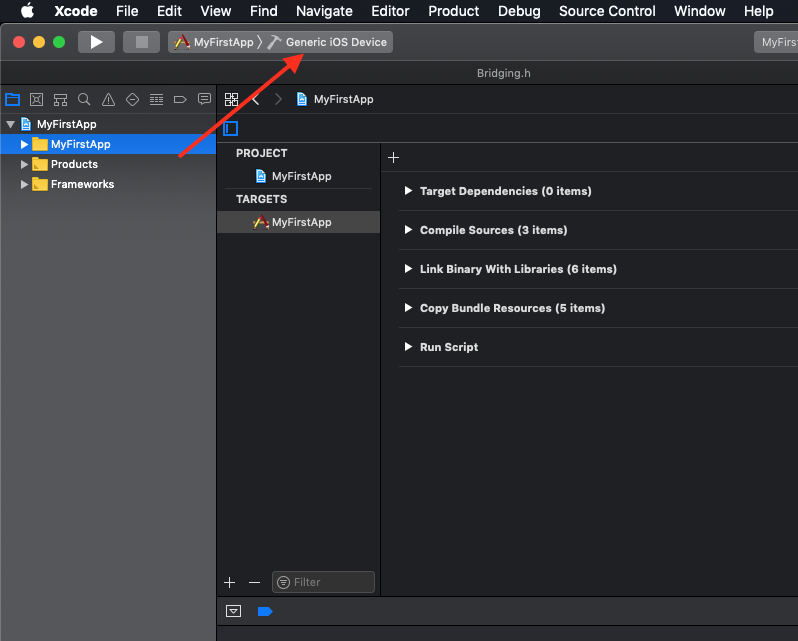
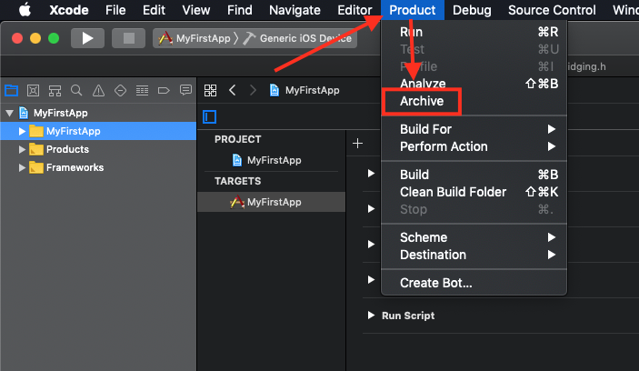
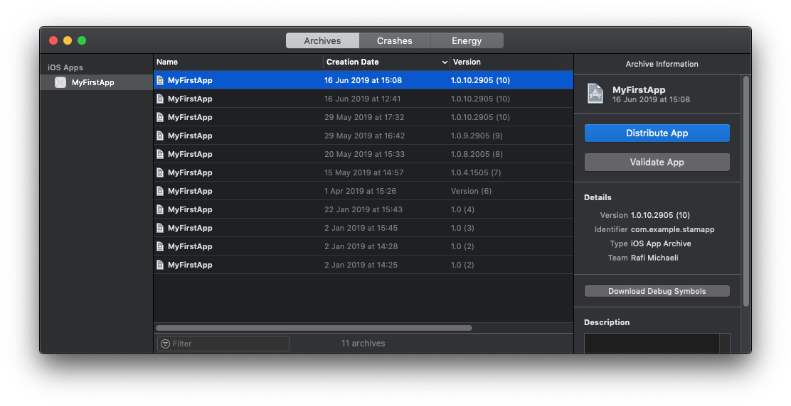
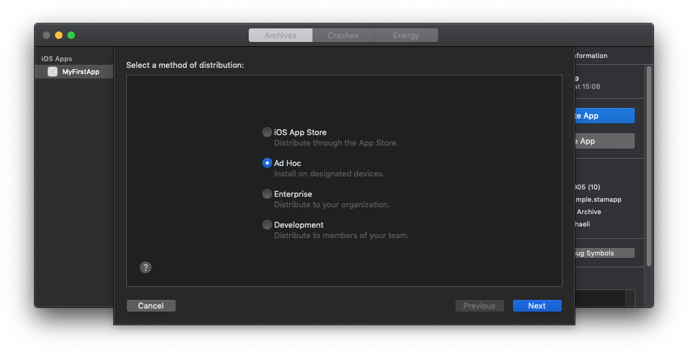
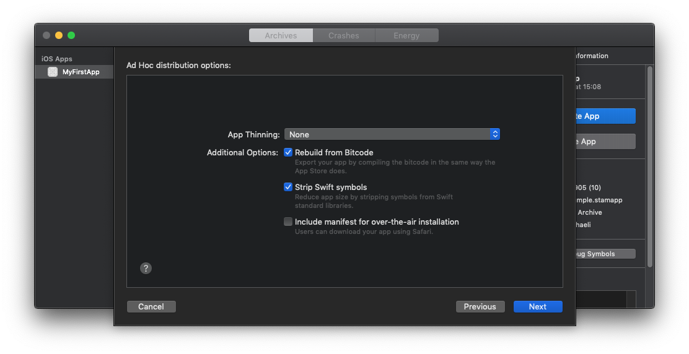
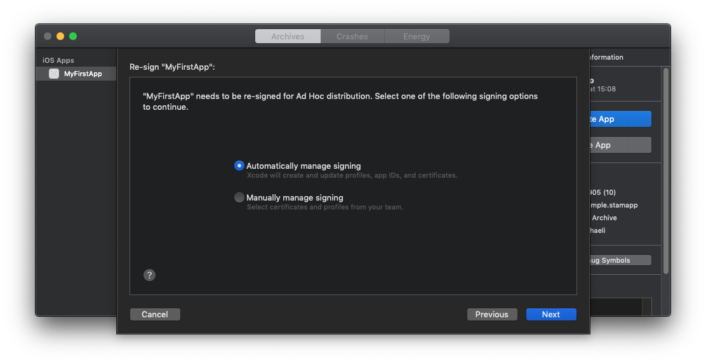
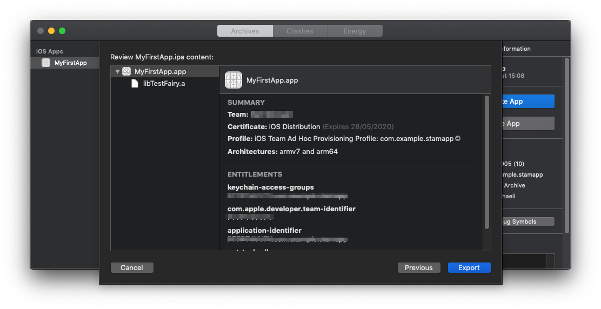

Apple allows app distribution for testing on registered devices using an Ad-Hoc or Enterprise provisioning profile. 

The output file you create is an iOS App file (a file with an `.ipa` filename extension) that they can then use to install your app on registered devices. Following are the steps to export your app for testing:

1. Register all test devices.
2. Archive your app.
3. Export the archive to an IPA file using either an ad hoc provisioning profile or team provisioning profile to code sign your app.
4. Install the app on test devices.

## About Ad Hoc Provisioning Profiles

An ad hoc provisioning profile is a distribution provisioning profile that allows your app to be installed on designated devices and to use app services without the assistance of Xcode. 

There are 4 types of distribution provisioning profiles you can create for apps:
  - iOS App Store - for distributing through the apple app store.
  
  - Ad Hoc - for installing on **designated devices**.
  
  - [Enterprise](https://developer.apple.com/programs/enterprise/) - for distributing an app within your organization.
  
  - [Development](https://developer.apple.com/support/certificates/) - For distributing within members of your team.
  

Make sure you have created an Ad Hoc provisioning profile specifying an `App ID` that matches one or more of your apps, a set of **test devices**, and a single **distribution certificate** at the [developer portal](https://idmsa.apple.com/IDMSWebAuth/login?&appIdKey=891bd3417a7776362562d2197f89480a8547b108fd934911bcbea0110d07f757&path=%2F%2Fmembercenter%2Findex.action).

We warmly recommend any company to apply to Apple's iOS Developer [Enterprise Program](https://developer.apple.com/programs/enterprise/), and sign iOS apps for internal use with an Enterprise certificate. 
* Please note that this is not a legal document, and refer to Apple's website for the exact terms of service for any Apple service.

## Archiving Your App

Create an archive of your app. Xcode stores this archive in the **Archives organizer**.

In the Xcode project editor, choose `Generic iOS Device` — or your device name from the Scheme toolbar menu. (You can’t create an archive of a simulator build).

If a device is connected to your Mac, the device name appears in the Scheme toolbar menu. When you disconnect the device, the menu item changes to the `Generic iOS Device`.

Choose **Product** --> **Archive**.

The Archives organizer appears and displays the new archive. 

Xcode runs preliminary validation tests on the archive. To create an IPA file press the `Distribute App` button.

## Exporting Your App to an IPA (**Ad Hoc** provisioning profile)

To create an iOS App file for testing, select an archive in the **Archives organizer**.

Click the **Distribute App** button. Select an export option, and click Next.

To distribute your app to users with designated devices, choose the  `Save for Ad Hoc Deployment`. The app will be code signed with the distribution certificate.

In the dialog that appears, choose a signing method and click Next.

In the distributions options screen, choose the options you prefer and click Next.

After you choose the signing options click **Next**.

In the dialog that appears, review the app, its entitlements, and the provisioning profile.
Click **Export** and finally the Finder shows the exported files. Save it to your desired location.

## Installing Your App on Test Devices Using Xcode

You can install iOS App files on devices using Xcode.

To install an app on a device using Xcode

1. Connect the device to your Mac.
1. In Xcode, choose Window > Devices and select the device under Devices.
1. In the Installed Apps table, click the Add button (+) below the table.
1. In the dialog that appears, choose the iOS App file and click Open

##  Accessing Logs from Xcode

Accessing raw logs on an iOS device requires hooking up that device via a USB cable to a computer. System logs often help a lot in debugging vague problems around app installation.

Many times, the error displayed on an iOS device screen is too generic, but the system logs explain more thoroughly the reason for the problem. In order to get the logs, complete the following:

* Open Xcode.
* Open menu Window -> Devices.
* Select the device which you want to inspect.
* Click on the little arrow toggle button at the bottom of the window.
* A new divider will open up with up-to-date logs from the device.

# References

1. [Apple developer site](https://developer.apple.com/library/ios/documentation/IDEs/Conceptual/AppDistributionGuide/TestingYouriOSApp/TestingYouriOSApp.html)

